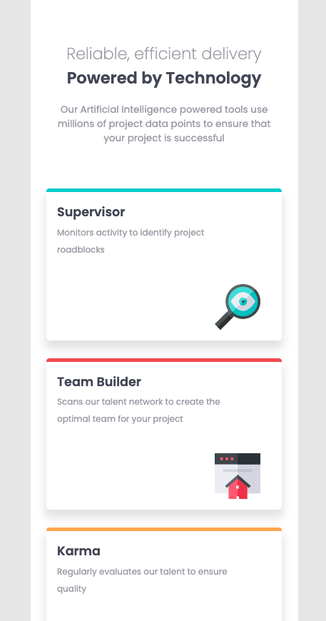
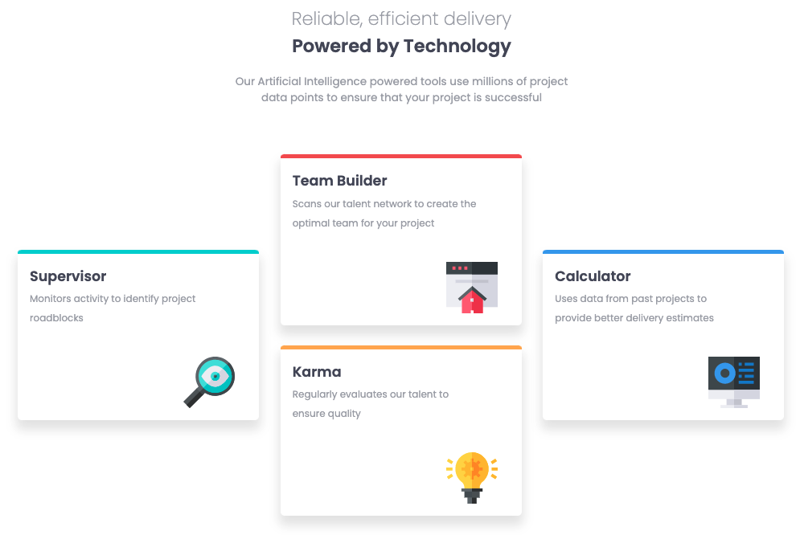

# Frontend Mentor - Four card feature section solution

This is a solution to the [Four card feature section challenge on Frontend Mentor](https://www.frontendmentor.io/challenges/four-card-feature-section-weK1eFYK). Frontend Mentor challenges help you improve your coding skills by building realistic projects. 

## Table of contents

- [Overview](#overview)
  - [The challenge](#the-challenge)
  - [Screenshot](#screenshot)
  - [Links](#links)
- [My process](#my-process)
  - [Built with](#built-with)
  - [What I learned](#what-i-learned)
  - [Continued development](#continued-development)
  - [Useful resources](#useful-resources)
- [Author](#author)
- [Acknowledgments](#acknowledgments)

## Overview

### The challenge

Users should be able to:

- View the optimal layout for the site depending on their device's screen size

### Screenshot




### Links

- Solution URL: [Add solution URL here](https://github.com/nickfwilliams/frontend-mentor/tree/master/FourCardFeature)
- Live Site URL: [Add live site URL here](https://nickfwilliams.github.io/frontend-mentor/FourCardFeature/index.html)

## My process

For this project I started with the mobile design and wrote all of my HTML before moving onto the CSS. Creating the site from a mobile first approach made it easier to then write the media queries for the desktop version as I already knew that the overall layout/structure worked well. For the desktop version, I needed to focus on the use of grid for the cards but once I played about with a few arrangements, it became clear what needed to be done to get the staggered effect.

### Built with

- Semantic HTML5 markup
- CSS custom properties
- Flexbox
- CSS Grid
- Mobile-first workflow

### What I learned

During this project I learned that if you can position a div or section across two rows, so it straddles them. See code below:

```html
    <section class="card-container">

      <div class="card supervisor">
        <h3 class="card-title">Supervisor</h3>
        <p class="card-text">Monitors activity to identify project roadblocks</p>
        
      </div>

    </section>
```
```css
    .card-container {
        display: grid;
        grid-template-columns: repeat(3, 1fr);
        grid-template-rows: repeat(2,1fr);
    }

    .card {
        max-width: 300px;
    }

    .supervisor {
        grid-row: 1/3;
    }
```

### Continued development

I'm feeling better about my understanding of grid following that exercise. It's still early days but that task was relatively easy and didn't require much troubleshooting. I'd like to do another one or two grid focused challenages before I start to incorporate some JS into my learning.

### Useful resources

- [Example resource 1](https://css-tricks.com/snippets/css/complete-guide-grid/) - No explanation needed!
- [Example resource 2](https://docs.emmet.io/cheatsheet-a5.pdf) - Thanks to the FEM community, I discovered emmet and used this for the first time during this project - what a time saver!

## Author

- Website - [Nick Williams](https://nickfwilliams.co.uk)
- Frontend Mentor - [@ynickfwilliams](https://www.frontendmentor.io/profile/nickfwilliams)
- Github - [@nickfwilliams](https://github.com/nickfwilliams/)

## Acknowledgments

Big shout-out to James on the FEM Slack channel for pointing me towards Emmet.
