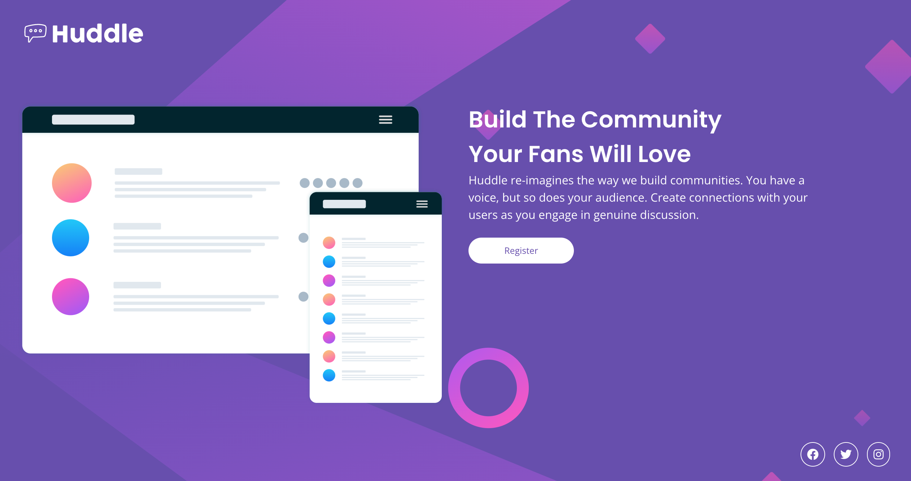

# Frontend Mentor - Huddle landing page with single introductory section solution

This is a solution to the [Huddle landing page with single introductory section challenge on Frontend Mentor](https://www.frontendmentor.io/challenges/huddle-landing-page-with-a-single-introductory-section-B_2Wvxgi0). Frontend Mentor challenges help you improve your coding skills by building realistic projects. 

## Table of contents

- [Overview](#overview)
  - [The challenge](#the-challenge)
  - [Screenshot](#screenshot)
  - [Links](#links)
- [My process](#my-process)
  - [Built with](#built-with)
  - [What I learned](#what-i-learned)
  - [Continued development](#continued-development)
  - [Useful resources](#useful-resources)
- [Author](#author)


## Overview

### The challenge

Users should be able to:

- View the optimal layout for the page depending on their device's screen size
- See hover states for all interactive elements on the page

### Screenshot




### Links

- Solution URL: [Add solution URL here](https://github.com/nickfwilliams/frontend-mentor/tree/master/LandingPage)
- Live Site URL: [Add live site URL here](https://nickfwilliams.github.io/frontend-mentor/LandingPage/index.html)

## My process

### Built with

- Semantic HTML5 markup
- CSS custom properties
- CSS Grid
- Mobile-first workflow

### What I learned

I used this project to practice the utility classes and grid skills that I learned from the Space Tourism project. The utility classes were very much overkill for such a simple project but it was really useful to put them into use and get my head around how they worked. I also could've used Flex for the mobile view, but wanted to make sure that I fully understood grid layout for both versions.

```css
@media (min-width: 45rem) {
  body {
    background-image: url(./images/bg-desktop.svg);
    background-size: cover;  
  }

  .grid-container {
    max-width: 80rem;
    grid-template-columns: repeat(2, 1fr);
    text-align: left;
    grid-template-areas: 
      'logo logo'
      'image content'
      'shortcuts shortcuts';
  }
}
```

### Continued development

More grid practice required! I definitely understand the main concepts but need to complete more complicated projects to fully get my head around everything it can do. 

### Useful resources

- [Example resource 1](https://cssgenerator.org/box-shadow-css-generator.html) - This helped me visualise and implement the CSS box-shadow needed for the hover button.
- [Example resource 2](https://grid.layoutit.com/) - Another great Grid layout tool that helped me visualise what I needed.

## Author

- Website - [Nick Williams](https://www.your-site.com)
- Frontend Mentor - [@nickfwilliams](https://www.frontendmentor.io/profile/nickfwilliams)
- Git Hub - [@nickfwilliams](https://www.github.com/nickfwilliams)

