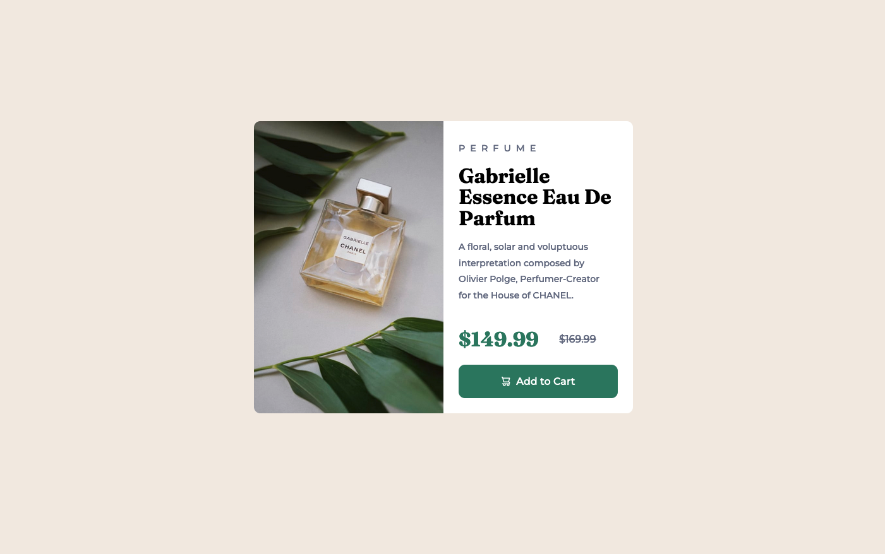
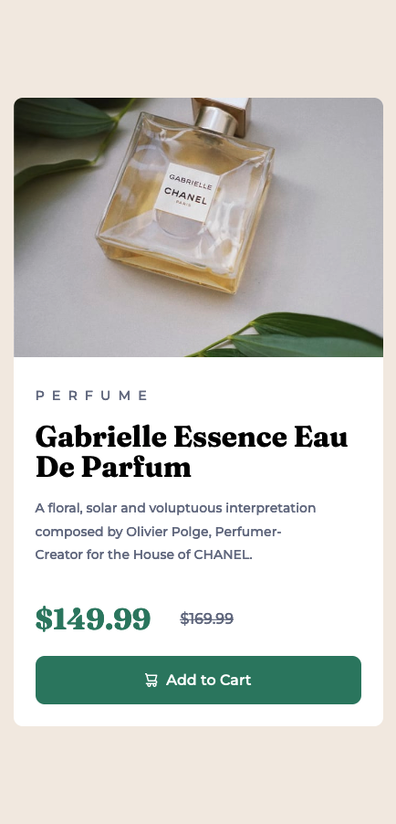

# Frontend Mentor - Product preview card component solution

This is a solution to the [Product preview card component challenge on Frontend Mentor](https://www.frontendmentor.io/challenges/product-preview-card-component-GO7UmttRfa). Frontend Mentor challenges help you improve your coding skills by building realistic projects. 

## Table of contents

- [Overview](#overview)
  - [The challenge](#the-challenge)
  - [Screenshot](#screenshot)
  - [Links](#links)
- [My process](#my-process)
  - [Built with](#built-with)
  - [What I learned](#what-i-learned)
  - [Continued development](#continued-development)
  - [Useful resources](#useful-resources)
- [Author](#author)

## Overview

### The challenge

Users should be able to:

- View the optimal layout depending on their device's screen size
- See hover and focus states for interactive elements

### Screenshot




### Links

- Solution URL: [Add solution URL here](https://github.com/nickfwilliams/frontend-mentor/tree/master/ProductPreviewComponent)
- Live Site URL: [Add live site URL here](https://nickfwilliams.github.io/frontend-mentor/ProductPreviewComponent/index.html)

## My process

I started the project with the mobile layout and got that to a point I was happy with before tackling the desktop version. I knew I wanted to go about it this way in order to use the 'min-width' media query to make sure I kept it 'mobile first'. 

### Built with

- Semantic HTML5 markup
- CSS custom properties
- Flexbox
- Mobile-first workflow

### What I learned

My main takeaway from this project was all around the button. Firstly, when to use a button rather than a stylized anchor tag (see URL below) and secondly, that in order to validate a button, you can't have divs or p tags inside it.

I was also happy with how my css solution to updating the image turned out - see below.

```css
@media only screen and (min-width: 600px) {
    .main-container {
        display: flex;
        flex-direction: row;
        max-width: 600px;
    }

    .main-image {
        content: url(images/image-product-desktop.jpg);
        min-width: 50%;
        object-fit: cover;
        border-radius: 10px 0 0 10px;
    }
}
```

### Continued development

I definitely need to up the difficulty of my next few projects as I feel like I'm now able to conceptualise the solution to these newbie challenges before I start coding. I think the best route would be to push the difficulty of the HTML & CSS challenges before getting stuck into any JS.

### Useful resources

- [Example resource 1](https://www.a11y-101.com/design/button-vs-link) - Really useful for helping me to understand when to use an anchor tag versus a button.
- [Example resource 2](https://coderjony.com/blogs/media-queries-in-css-min-width-and-max-width/) - Very helpful for further clarifying min-width versus max-width with media queries.

## Author

- Website - [Nick Williams](https://www.your-site.com)
- Frontend Mentor - [@nickfwilliams](https://www.frontendmentor.io/profile/nickfwilliams)
- Git Hub - [@nickfwilliams](https://www.github.com/nickfwilliams)
