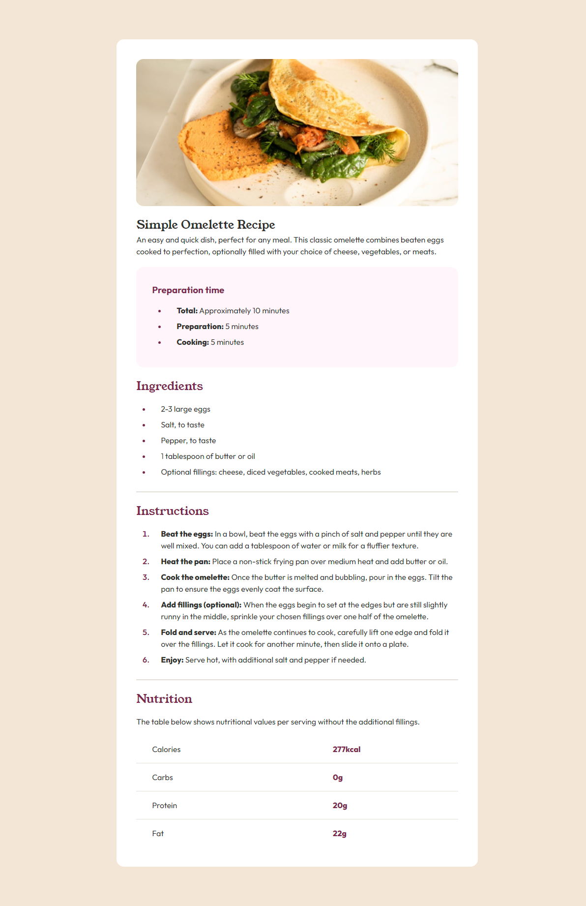
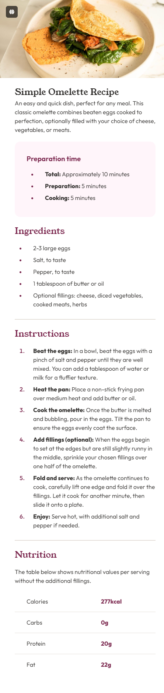

# Frontend Mentor - Recipe page solution

This is a solution to the [Recipe page challenge on Frontend Mentor](https://www.frontendmentor.io/challenges/recipe-page-KiTsR8QQKm). Frontend Mentor challenges help you improve your coding skills by building realistic projects.

## Table of contents

- [Overview](#overview)
  - [The challenge](#the-challenge)
  - [Screenshot](#screenshot)
  - [Links](#links)
- [My process](#my-process)
  - [Built with](#built-with)
  - [What I learned](#what-i-learned)
  - [Continued development](#continued-development)
  - [Useful resources](#useful-resources)
- [Author](#author)
- [Acknowledgments](#acknowledgments)

**Note: Delete this note and update the table of contents based on what sections you keep.**

## Overview

### Screenshot

### Links

- Solution URL: [Add solution URL here](https://www.frontendmentor.io/solutions/responsive-recipe-page-using-css-variables-and-cube-fsbsqHUwtR)
- Live Site URL: [Add live site URL here](https://nickfwilliams.github.io/frontend-mentor/RecipePageMain/index.html)

## My process

### Built with

- Semantic HTML5 markup
- CSS custom properties
- Flexbox
- CSS Grid
- CUBE

### What I learned

- The CUBE helps you plan out the CSS build but you still need to think about naming
- The the <tbody>for tables isn't always needed, depending on what the table looks like/contains
- That table borders need to be collapsed before you apply any styling - otherwise they can cause issues

### Continued development

I was surprised at how much I'd forgotten about tables and styling them! Makes me consider that I shouldn't bypass the more simple challenges as they will have bits in them that I haven't touched in a while and the knowledge refresh will be of use.

### Useful resources

- [Resource 1](https://www.w3schools.com/html/tryit.asp?filename=tryhtml_table_collapse) - This showed me how table collapse-borders works.

## Author

- Frontend Mentor - [@ennfer](https://www.frontendmentor.io/profile/ennfer)
- LinkedIn - [@nickfwilliams](https://www.linkedin.com/in/nickfwilliams/)
- CodeWars - [@nickfwilliams](https://www.codewars.com/users/nickfwilliams)
