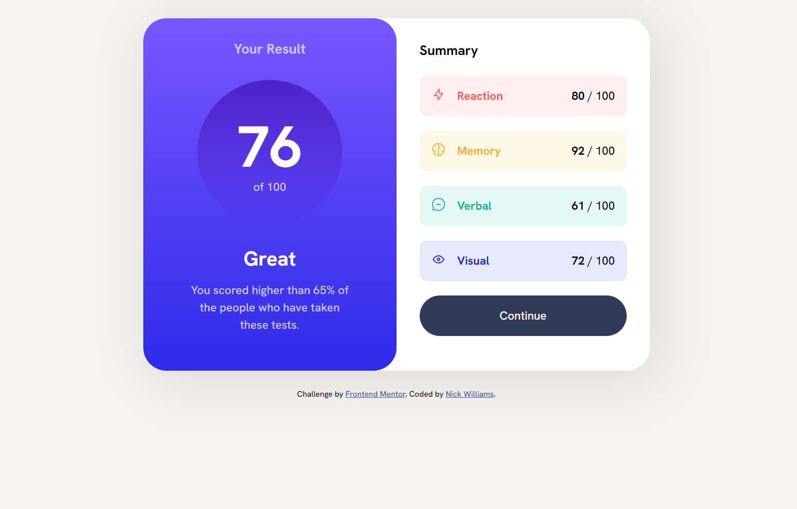
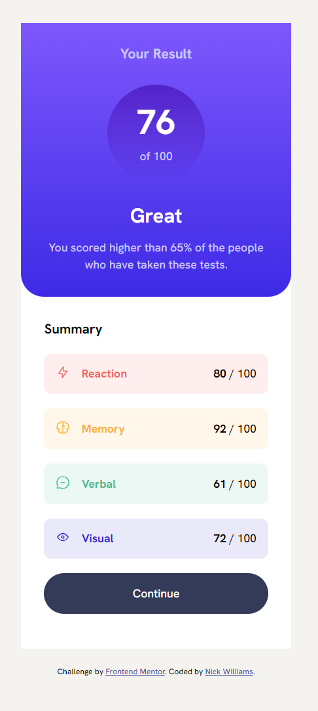

# Frontend Mentor - Results summary component solution

This is a solution to the [Results summary component challenge on Frontend Mentor](https://www.frontendmentor.io/challenges/results-summary-component-CE_K6s0maV). Frontend Mentor challenges help you improve your coding skills by building realistic projects.

## Table of contents

- [Overview](#overview)
  - [The challenge](#the-challenge)
  - [Screenshot](#screenshot)
  - [Links](#links)
- [My process](#my-process)
  - [Built with](#built-with)
  - [What I learned](#what-i-learned)
  - [Continued development](#continued-development)
  - [Useful resources](#useful-resources)
- [Author](#author)
- [Acknowledgments](#acknowledgments)

**Note: Delete this note and update the table of contents based on what sections you keep.**

## Overview

### The challenge

Users should be able to:

- View the optimal layout for the interface depending on their device's screen size
- See hover and focus states for all interactive elements on the page
- **Bonus**: Use the local JSON data to dynamically populate the content

### Screenshot




### Links

- Solution URL: [Add solution URL here](https://your-solution-url.com)
- Live Site URL: [Add live site URL here](https://nickfwilliams.github.io/frontend-mentor/ResultsSummaryComponent/)

## My process

### Built with

- Semantic HTML5 markup
- CSS custom properties
- Flexbox
- Mobile-first workflow
- JS/JSON

### What I learned

This challenge taught about the basic syntax of background gradients - which weren't complicated but I'd never used - and more importantly, the JS fetch API and how to use JSON data via a script.

I also learned that if I want to apply insertAdjacentHTML on several elements I need to iterate through them first and call the method on each.

To see how you can add code snippets, see below:

```html
<div class="score">
	<div class="score__img">
		
	</div>
	<div class="score__reaction"><p>Reaction</p></div>
	<div class="score__out-of">
		<div class="score-data"></div>
	</div>
</div>
```

```js
const userScores = document.querySelectorAll(".score-data");

fetch("./data.json")
	.then((res) => {
		return res.json();
	})
	.then((data) => {
		data.forEach((user, index) => {
			userScores[index].insertAdjacentHTML(
				"beforeend",
				`<p>${user.score} </p><p>/ 100</p>`
			);
		});
	});
```

### Continued development

Next steps will be to continue building projects that include JS and working on getting more comfortable with it. As ALL the tutorials say, to progress you need to be building things. It would also be useful to practice fetching more JSON data and using that in an HTML page.

### Useful resources

- [Example resource 1](https://www.youtube.com/watch?v=XJ63R1J05ik&ab_channel=HelpPeople) - This was a really helpful video for this challenge - it broke the steps down nicely and let me appreciate the structure of the data.
- [Example resource 2](https://www.youtube.com/watch?v=Oage6H4GX2o&ab_channel=ByteGrad) - This video broke down the fetch API really nicely and showed me how to use JS to query the JSON file.

## Author

- Frontend Mentor - [@nickfwilliams](https://www.frontendmentor.io/profile/yourusername)

## Acknowledgments
