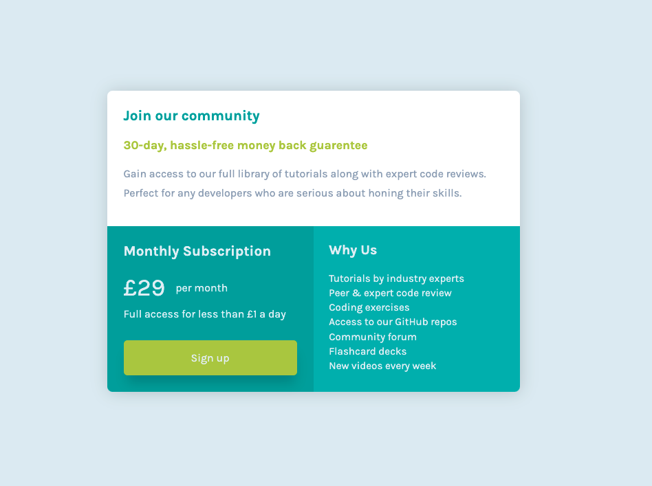

# Frontend Mentor - Single price grid component solution

This is a solution to the [Single price grid component challenge on Frontend Mentor](https://www.frontendmentor.io/challenges/single-price-grid-component-5ce41129d0ff452fec5abbbc). Frontend Mentor challenges help you improve your coding skills by building realistic projects. 

## Table of contents

- [Overview](#overview)
  - [The challenge](#the-challenge)
  - [Screenshot](#screenshot)
  - [Links](#links)
- [My process](#my-process)
  - [Built with](#built-with)
  - [What I learned](#what-i-learned)
  - [Continued development](#continued-development)
  - [Useful resources](#useful-resources)
- [Author](#author)
- [Acknowledgments](#acknowledgments)

## Overview

### The challenge

Users should be able to:

- View the optimal layout for the component depending on their device's screen size
- See a hover state on desktop for the Sign Up call-to-action

### Screenshot




### Links

- Solution URL: [Add solution URL here](https://github.com/nickfwilliams/frontend-mentor/tree/master/SinglePriceComponent)
- Live Site URL: [Add live site URL here](https://fem-single-price-component.vercel.app/)

## My process

### Built with

- Semantic HTML5 markup
- CSS custom properties
- CSS Grid
- Mobile-first workflow

### What I learned

This was my first grid project and once I refreshed the basics, coding the desktop version wasn't difficult. It did raise a few questions about correct fraction use but I referred to the example image and think I've got a pretty decent match. I've included the CSS below, purely because it's the first grid I've written for a project.

To see how you can add code snippets, see below:

```css
@media only screen and (min-width: 1000px)
    {

        .main-container {
            max-width: 600px;
            display: grid;
            grid-template-columns: 1fr 1fr;
            grid-template-rows: 1.8fr 2.2fr;
        }

        .community {
            grid-column: 1 / 3;
        }
```

### Continued development

I think the next project needs to be more challenging from a grid perspective. Everything else sees to be slowly improving but I need to make sure my flexbox and grid understanding is sharp before I go back to tussling with Javascript.

### Useful resources

- [Example resource 1](https://css-tricks.com/snippets/css/complete-guide-grid/) - Where would we be without the css-trick complete guides!?
- [Example resource 2](https://stackoverflow.com/questions/62056294/github-folders-have-a-white-arrow-on-them) - This thread was really useful in helping me unpick nesting folders in Github.

## Author

- Website - [Nick Williams](https://www.nickfwilliams.co.uk)
- Frontend Mentor - [@nickfwilliams](https://www.frontendmentor.io/profile/nickfwilliams)
- Twitter - [@nickfwilliams](https://www.github.com/nickfwilliams)

## Acknowledgments

No immediate acknowledgements needed for this solution, except a general shoutout to the FEM community!
