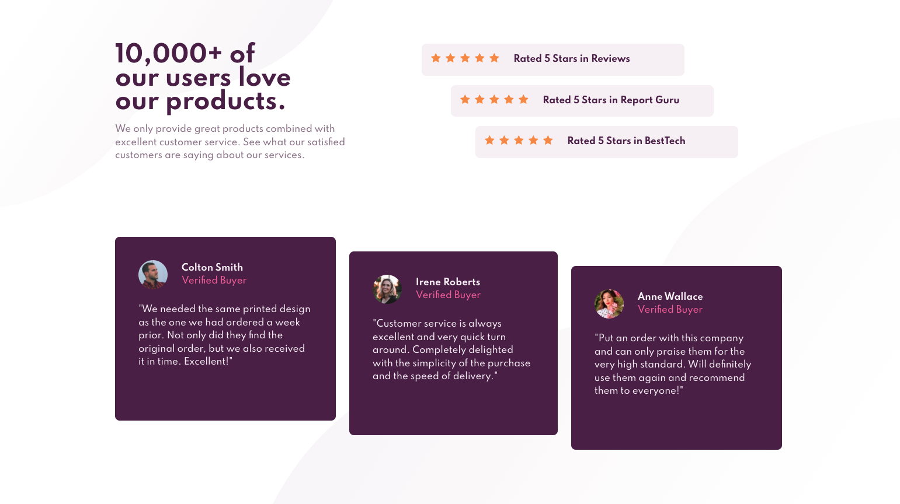

# Frontend Mentor - Social proof section solution

This is a solution to the [Social proof section challenge on Frontend Mentor](https://www.frontendmentor.io/challenges/social-proof-section-6e0qTv_bA). Frontend Mentor challenges help you improve your coding skills by building realistic projects.

## Table of contents

- [Overview](#overview)
  - [The challenge](#the-challenge)
  - [Screenshot](#screenshot)
  - [Links](#links)
- [My process](#my-process)
  - [Built with](#built-with)
  - [What I learned](#what-i-learned)
  - [Continued development](#continued-development)
  - [Useful resources](#useful-resources)
- [Author](#author)

## Overview

### The challenge

Users should be able to:

- View the optimal layout for the section depending on their device's screen size

### Screenshot

### Links

- Solution URL: [Add solution URL here](https://github.com/nickfwilliams/frontend-mentor/tree/master/SocialProofSection)
- Live Site URL: [Add live site URL here](https://nickfwilliams.github.io/frontend-mentor/SocialProofSection/index.html")

## My process

For this project, I started with the mobile design and then moved onto the desktop version utilising grid. I found this presented some chllanges with heights and the page sizing transition from desktop to mobile.

### Built with

- Semantic HTML5 markup
- CSS custom properties
- Flexbox
- CSS Grid
- Mobile-first workflow

### What I learned

From this project I learned that it's often best to have a grid within a container div, not make the container div the grid also. By not separating the two I gave myself a few headaches with height isses and I feel that I could've made the solution more elegant had I gone down the route of body > container > grid-layout.

Despite the above, I did use previous learning to insert some extra columns and used these as left and right responsive margins.

I was particularly happy with realising I could use scale/translate to stagger the reviews rather than relying on margin.

### Continued development

Mpre grid practice required - I was surprised at how niggly this project was, especially as it's a newbie one.

### Useful resources

- [Example resource 1](https://www.digitalocean.com/community/tutorials/css-css-grid-layout-fr-unit) - I used this site for help with underdtanding grid size units.
- [Example resource 2](https://techstacker.com/how-to-prevent-image-stretching-with-flexbox/#:~:text=Fortunately%2C%20the%20solution%20is%20simple,middle%20of%20its%20parent%20container.) - This provided me with the solution to stopping the star images sretching as a flex item.

## Author

- Website - [Add your name here](https://nickfwilliams.co.uk)
- Frontend Mentor - [@nickfwilliams](https://www.frontendmentor.io/profile/nickfwilliams)
- Github - [@nickfwilliams](https://www.github.com/nickfwilliams)
